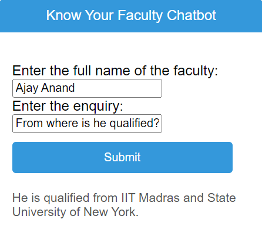

## Know Your Faculty Chatbot

This project implements a chatbot that allows users to inquire about faculty information stored in a CSV file.



### Features

- Users can enter the full name of a faculty member.
- Users can specify their enquiry related to the faculty member's information (e.g., phone number, research area - extracted from "Description" in CSV).
- The chatbot retrieves relevant information from the CSV and uses OpenAI's Large Language Model (LLM) to potentially answer the user's enquiry more comprehensively, leveraging the textual content in the "Description" field.

### Technologies Used

- **Frontend:**
    - HTML: for building the user interface.
    - CSS: for styling the user interface.
    - JavaScript: for handling user interaction and communication with the backend.
- **Backend:**
    - Flask: a Python web framework for building the server-side application.
    - Pandas: a Python library for data manipulation (used to read and process the faculty data).
    - langchain: a Python library for interacting with Large Language Models (LLMs) like OpenAI.

### Running the Project

1. **Prerequisites:**
   - Ensure you have Python (3.10 recommended) and Node.js (for JavaScript) installed on your system.
   - Install the required Python libraries:
     ```bash
     pip install Flask pandas langchain openai
     ```
2. **Clone the repository:**
   ```bash
   git clone https://github.com/Nams02/know-your-faculty-chatbot.git
   ```
3. **Obtain and set your OpenAI API key:**
   - Create an account on OpenAI ([https://openai.com/](https://openai.com/)) and obtain an API key.
   - Set the `OPENAI_API_KEY` environment variable with your key:
     - **Option 1:** In your terminal, run:
       ```bash
       export OPENAI_API_KEY='your_api_key'
       ```
     - **Option 2:** Create a `.env` file in your project root and add the line:
       ```
       OPENAI_API_KEY=your_api_key
       ```
       Make sure to configure your development environment to load environment variables from this file (consult your environment's documentation for details).
4. **Data Preparation:**
   - Ensure the `fdata.csv` file exists in the project directory.
   - The CSV file should be formatted correctly with the following:
     - Delimiter: Semicolon (`;`)
     - Required Columns:
       - `Name`: Full name of the faculty member (used for matching user input).
       - `Phone Number` (optional)
       - `Description`: Textual description of the faculty member's expertise and areas of interest. This field is used for potentially answering user enquiries beyond pre-defined data points with the help of the LLM.
       - Other columns can be included as needed (e.g., Email Address, Subjects).
5. **Run the application:**
   ```bash
   python main.py
   ```
   This will start the Flask development server, typically accessible at `http://localhost:5000/` by default (the port might vary, check the terminal output for the actual port number).

**Please note:**

- This is a basic example, and a production deployment might require additional configuration.
- Consider replacing `'your_api_key'` with actual instructions on how to obtain and set the OpenAI API key securely (avoid committing it to version control).

### Deployment

For production deployment, consider using a cloud hosting platform like Heroku or AWS and following their deployment guides for Flask applications.

### Contributing

We welcome contributions to this project! Please contact us to know how.

### Disclaimer

The use of the Large Language Model (LLM) introduces a degree of uncertainty in the responses generated by the chatbot. While the LLM is trained on a massive dataset of text and code, its responses may not always be accurate or complete. It is recommended to use the chatbot's responses for informational purposes only and to consult with the faculty member directly for any critical or sensitive matters.
